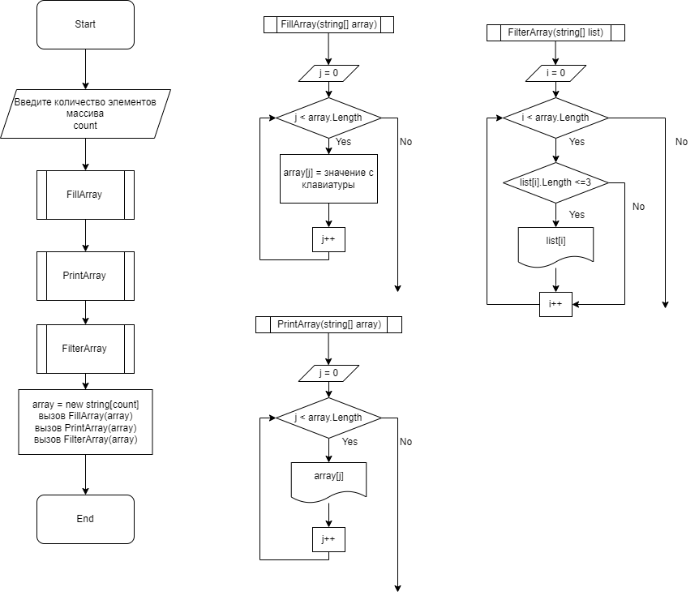

# **Алгоритм программы представлен на рисунке ниже:**

# **Описание алгоритма**
- С самого начала запрашиваем у пользователя, из скольки элементов будет состоять изходный массив, переменной 

      "count" 

    присваиваем значение, введенное с клавиатуры;

- Далее используем метод:

         FillArray
         
    который позволяет нам заполнить массив поэлементно с клавиатуры; 

- Далее методом:

        PrintArray 
    
    выводим поэлементно получившийся массив, введенный с клавиатуры;

- Методом:

        FilterArray 
    проверяем длины каждого элемента массива, введенного с клавиатуры, и те элементы, длина которых более 3 символов выводим на экран;

- После всего создаем строковый массив, с числом элементов count, и поочередно вызываем созданные методы:

        FillArray
        PrintArray 
        FilterArray 

